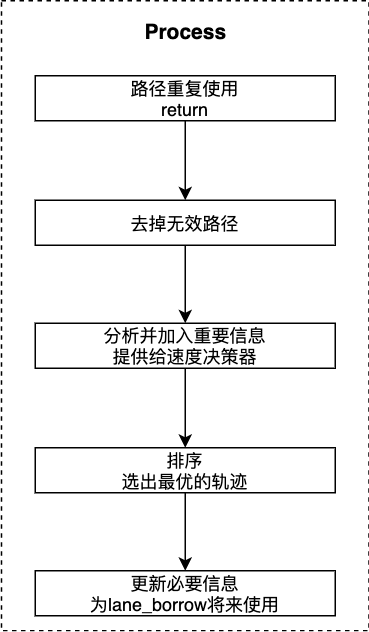

# 路径评估决策

### *目录*

- [概览](#概览)
- [路径评估决策相关代码及对应版本](#路径评估决策相关代码及对应版本)
- [路径评估决策代码流程及框架](#路径评估决策代码流程及框架)
  - [路径重复使用](#路径重复使用)
  - [去掉无效路径](#去掉无效路径)
  - [分析并加入重要信息](#分析并加入重要信息)
  - [排序并选出最有路径](#排序并选出最有路径)
  - [更新必要信息](#更新必要信息)
- [路径排序算法解析](#路径排序算法解析)

# 概览

`路径评估决策`是规划模块的任务，属于task中的decider类别。

规划模块的运动总体流程图如下：


总体流程图以[lane follow](https://github.com/ApolloAuto/apollo/blob/r6.0.0/modules/planning/conf/scenario/lane_follow_config.pb.txt)场景为例子进行说明。task的主要功能位于`Process`函数中。

Fig.1的具体运行过程可以参考[path_bounds_decider]()。

# 路径评估决策相关代码及对应版本

本节说明path assessment decider的代码流程。

请参考代码[Apollo 10.0 path_assessment_decider_util](https://github.com/ApolloAuto/apollo/blob/master/modules/planning/planning_interface_base/task_base/common/path_util/path_assessment_decider_util.cc)

- 输入

`Status PathAssessmentDecider::Process(Frame* const frame, ReferenceLineInfo* const reference_line_info)`

输入Frame，reference_line_info。具体解释可以参考[path_bounds_decider]()。

- 输出

路径排序之后，选择第一个路径。结果保存在reference_line_info中。

# 路径评估决策代码流程及框架

代码主体流程如下图：



## 路径重复使用

```C++
  ... ...
  // 如果路径重复使用则跳过
  if (FLAGS_enable_skip_path_tasks && reference_line_info->path_reusable()) {
    return Status::OK();
  ... ...
```

## 去掉无效路径

```C++
  ... ...
  // 1. 删掉无效路径.
  std::vector<PathData> valid_path_data;
  for (const auto& curr_path_data : candidate_path_data) {
    // RecordDebugInfo(curr_path_data, curr_path_data.path_label(),
    //                 reference_line_info);
    if (curr_path_data.path_label().find("fallback") != std::string::npos) {
      if (IsValidFallbackPath(*reference_line_info, curr_path_data)) {
        valid_path_data.push_back(curr_path_data);
      }
    } else {
      if (IsValidRegularPath(*reference_line_info, curr_path_data)) {
        valid_path_data.push_back(curr_path_data);
      }
    }
  }
  const auto& end_time1 = std::chrono::system_clock::now();
  std::chrono::duration<double> diff = end_time1 - end_time0;
  ADEBUG << "Time for path validity checking: " << diff.count() * 1000
         << " msec.";
  ... ...
```
其中fallback的无效路径是偏离参考线以及道路的路径。regular的无效路径是偏离参考线、道路，碰撞，停在相邻的逆向车道的路径。

## 分析并加入重要信息

```C++
  ... ...
  // 2. 分析并加入重要信息给speed决策
  size_t cnt = 0;
  const Obstacle* blocking_obstacle_on_selflane = nullptr;
  for (size_t i = 0; i != valid_path_data.size(); ++i) {
    auto& curr_path_data = valid_path_data[i];
    if (curr_path_data.path_label().find("fallback") != std::string::npos) {
      // remove empty path_data.
      if (!curr_path_data.Empty()) {
        if (cnt != i) {
          valid_path_data[cnt] = curr_path_data;
        }
        ++cnt;
      }
      continue;
    }
    SetPathInfo(*reference_line_info, &curr_path_data);
    // 修剪所有的借道路径，使其能够以in-lane结尾
    if (curr_path_data.path_label().find("pullover") == std::string::npos) {
      TrimTailingOutLanePoints(&curr_path_data);
    }

    // 找到 blocking_obstacle_on_selflane, 为下一步选择车道做准备
    if (curr_path_data.path_label().find("self") != std::string::npos) {
      const auto blocking_obstacle_id = curr_path_data.blocking_obstacle_id();
      blocking_obstacle_on_selflane =
          reference_line_info->path_decision()->Find(blocking_obstacle_id);
    }

    // 删掉空路径
    if (!curr_path_data.Empty()) {
      if (cnt != i) {
        valid_path_data[cnt] = curr_path_data;
      }
      ++cnt;
    }

    // RecordDebugInfo(curr_path_data, curr_path_data.path_label(),
    //                 reference_line_info);
    ADEBUG << "For " << curr_path_data.path_label() << ", "
           << "path length = " << curr_path_data.frenet_frame_path().size();
  }
  valid_path_data.resize(cnt);
  // 如果没有有效路径，退出
  if (valid_path_data.empty()) {
    const std::string msg = "Neither regular nor fallback path is valid.";
    AERROR << msg;
    return Status(ErrorCode::PLANNING_ERROR, msg);
  }
  ADEBUG << "There are " << valid_path_data.size() << " valid path data.";
  const auto& end_time2 = std::chrono::system_clock::now();
  diff = end_time2 - end_time1;
  ADEBUG << "Time for path info labeling: " << diff.count() * 1000 << " msec.";
  ... ...
```
这一步骤的代码执行流程如下：
1). 去掉空的路径
2). 从尾部开始剪掉lane-borrow路径，从尾部开始向前搜索，剪掉如下类型path_point：
&emsp; (1) OUT_ON_FORWARD_LANE
&emsp; (2) OUT_ON_REVERSE_LANE
&emsp; (3) 未知类型
3). 找到自车道的障碍物id，用于车道选择
4). 如果没有有效路径，返回错误码

## 排序并选出最有路径

这一步请看最后一章`相关算法解析`

## 更新必要信息

```C++
  // 4. Update necessary info for lane-borrow decider's future uses.
  // Update front static obstacle's info.
  auto* mutable_path_decider_status = injector_->planning_context()
                                          ->mutable_planning_status()
                                          ->mutable_path_decider();
  if (reference_line_info->GetBlockingObstacle() != nullptr) {
    int front_static_obstacle_cycle_counter =
        mutable_path_decider_status->front_static_obstacle_cycle_counter();
    mutable_path_decider_status->set_front_static_obstacle_cycle_counter(
        std::max(front_static_obstacle_cycle_counter, 0));
    mutable_path_decider_status->set_front_static_obstacle_cycle_counter(
        std::min(front_static_obstacle_cycle_counter + 1, 10));
    mutable_path_decider_status->set_front_static_obstacle_id(
        reference_line_info->GetBlockingObstacle()->Id());
  } else {
    int front_static_obstacle_cycle_counter =
        mutable_path_decider_status->front_static_obstacle_cycle_counter();
    mutable_path_decider_status->set_front_static_obstacle_cycle_counter(
        std::min(front_static_obstacle_cycle_counter, 0));
    mutable_path_decider_status->set_front_static_obstacle_cycle_counter(
        std::max(front_static_obstacle_cycle_counter - 1, -10));
  }

  // Update self-lane usage info.
  if (reference_line_info->path_data().path_label().find("self") !=
      std::string::npos) {
    // && std::get<1>(reference_line_info->path_data()
    //                 .path_point_decision_guide()
    //                 .front()) == PathData::PathPointType::IN_LANE)
    int able_to_use_self_lane_counter =
        mutable_path_decider_status->able_to_use_self_lane_counter();

    if (able_to_use_self_lane_counter < 0) {
      able_to_use_self_lane_counter = 0;
    }
    mutable_path_decider_status->set_able_to_use_self_lane_counter(
        std::min(able_to_use_self_lane_counter + 1, 10));
  } else {
    mutable_path_decider_status->set_able_to_use_self_lane_counter(0);
  }

  // Update side-pass direction.
  if (mutable_path_decider_status->is_in_path_lane_borrow_scenario()) {
    bool left_borrow = false;
    bool right_borrow = false;
    const auto& path_decider_status =
        injector_->planning_context()->planning_status().path_decider();
    for (const auto& lane_borrow_direction :
         path_decider_status.decided_side_pass_direction()) {
      if (lane_borrow_direction == PathDeciderStatus::LEFT_BORROW &&
          reference_line_info->path_data().path_label().find("left") !=
              std::string::npos) {
        left_borrow = true;
      }
      if (lane_borrow_direction == PathDeciderStatus::RIGHT_BORROW &&
          reference_line_info->path_data().path_label().find("right") !=
              std::string::npos) {
        right_borrow = true;
      }
    }

    mutable_path_decider_status->clear_decided_side_pass_direction();
    if (right_borrow) {
      mutable_path_decider_status->add_decided_side_pass_direction(
          PathDeciderStatus::RIGHT_BORROW);
    }
    if (left_borrow) {
      mutable_path_decider_status->add_decided_side_pass_direction(
          PathDeciderStatus::LEFT_BORROW);
    }
  }
  const auto& end_time4 = std::chrono::system_clock::now();
  diff = end_time4 - end_time3;
  ADEBUG << "Time for FSM state updating: " << diff.count() * 1000 << " msec.";

  // Plot the path in simulator for debug purpose.
  RecordDebugInfo(reference_line_info->path_data(), "Planning PathData",
                  reference_line_info);
  return Status::OK();
```

更新必要信息：

1.更新adc前方静态障碍物的信息
2.更新自车道使用信息3.更新旁车道的方向
(1) 根据PathDeciderStatus是RIGHT_BORROW或LEFT_BORROW判断是从左侧借道，还是从右侧借道

# 路径排序算法解析

最后这里说明排序算法。
```C++
  ... ...
  // 3. Pick the optimal path.
  std::sort(valid_path_data.begin(), valid_path_data.end(),
            std::bind(ComparePathData, std::placeholders::_1,
                      std::placeholders::_2, blocking_obstacle_on_selflane));

  ADEBUG << "Using '" << valid_path_data.front().path_label()
         << "' path out of " << valid_path_data.size() << " path(s)";
  if (valid_path_data.front().path_label().find("fallback") !=
      std::string::npos) {
    FLAGS_static_obstacle_nudge_l_buffer = 0.8;
  }
  *(reference_line_info->mutable_path_data()) = valid_path_data.front();
  reference_line_info->SetBlockingObstacle(
      valid_path_data.front().blocking_obstacle_id());
  const auto& end_time3 = std::chrono::system_clock::now();
  diff = end_time3 - end_time2;
  ADEBUG << "Time for optimal path selection: " << diff.count() * 1000
         << " msec.";

  reference_line_info->SetCandidatePathData(std::move(valid_path_data));
  ... ...
```
排序算法的流程具体如下：

`ComparePathData(lhs, rhs, …)`

路径排序：（道路评估的优劣通过排序获得）
- 1.空的路径永远排在后面
- 2.regular > fallback
- 3.如果self-lane有一个存在，选择那个。如果都存在，选择较长的.如果长度接近，选择self-lane如果self-lane都不存在，选择较长的路径
- 4.如果路径长度接近，且都要借道:
    - (1) 都要借逆向车道，选择距离短的
    - (2) 针对具有两个借道方向的情况:
      + 有障碍物，选择合适的方向，左或右借道
      + 无障碍物，根据adc的位置选择借道方向
    - (3) 路径长度相同，相邻车道都是前向的，选择较早返回自车道的路径
    - (4) 如果路径长度相同，前向借道，返回自车道时间相同，选择从左侧借道的路径
- 5.最后如果两条路径相同，则 lhs is not < rhl排序之后：选择最优路径，即第一个路径
