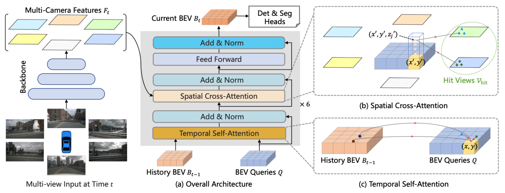
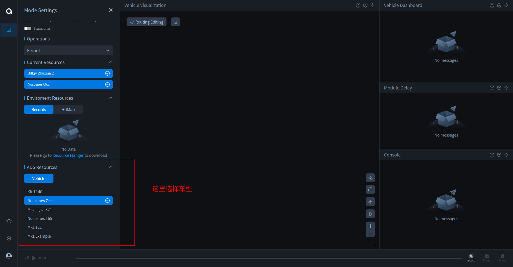
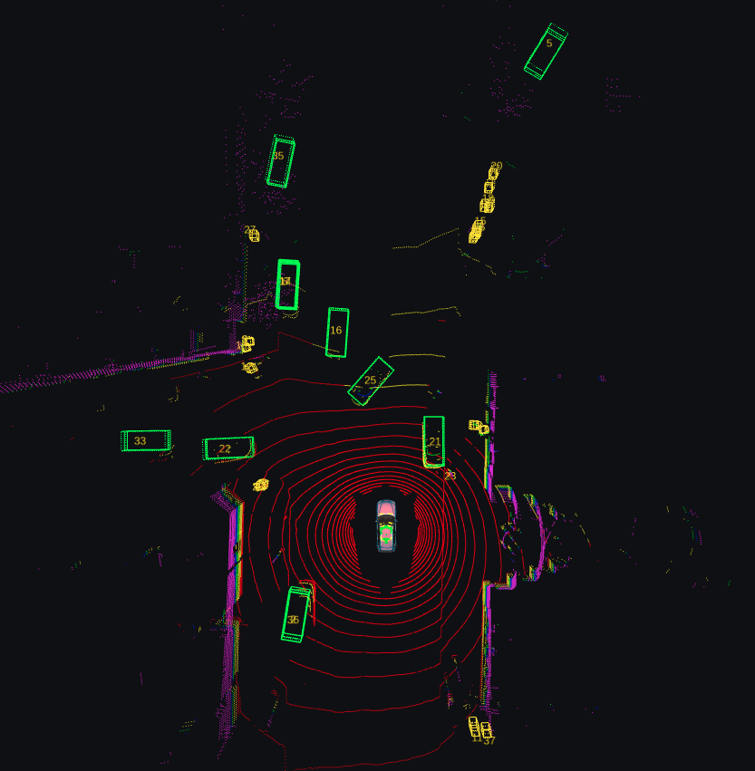

## Introduction

Recently, a new trend is to use multi-camera and bev representation to achieve the 3d object detection and occupancy prediction task. The BEVFormer takes the multi-camera images as inputs, utilizes the transformer architecture to predict 3d object bounding boxes. Meanwhile, occupancy prediction is a geometry-aware representation that quantizes the physical 3D scene into structured grid map with semantic labels per cell, where the voxels represents the corresponding position in the real world being occupied and different colors represent different semantic class. Compared to the form of bounding box, occupancy could capture the fine-grained details of critical obstacles in the scene, and thereby facilitate subsequent tasks.




Apollo 10.0 introduce the camera-only model _Apollo-vision-Net_

1. 【 _Advanced_ 】Introduce the _BEV+Transformer_ architecture for 3d object detection and occupancy detection into apollo project.
2. 【 _Great Performance_ 】Obtain an evident performance gain upon 3d object detection and occupancy detection tasks. We achieve _31.94% mAP_ (6.74 points higher than bevformer), _21.78% miou_ (2.39 points higher than OccNet)
3. 【 _High Efficiency_ 】Utilize shared backbone and joint training of multi-task, achieves the _5Hz_ inference frame rate on single _jetson orin_ platform

## Apollo-vision-Net

### Overview

- We feed multi-camera images to the backbone network, and obtain the features of different camera views.
- Use Transformer encoder to generate the bev features.
  - The encoder layer contains grid-shaped BEV queries, temporal self-attention, and spatial cross-attention.
  - In spatial cross- attention, each BEV query only interacts with image features in the regions of interest.
  - In temporal self-attention, each BEV query interacts with two features: the BEV queries at the current timestamp and the BEV features at the previous timestamp.
- Taking the BEV features as input, the multi-task head predicts the preception results.
  - The 3D detection head predicts the 3D bounding box and the class probability like BEVFormer.
  - The occupancy head first upsamples the BEV features to original resolution and then use linear layer to predict the occupancy probability of each voxel.


Our Apollo vision Net proposes several works as follows, significantly improving the performance of 3D detection and occupancy prediction.

- Image backbone: Replacing ResNet-50 with pre-trained DLA-34 using depth estimation data (Toyota DDAD15M) reduces model complexity while improving performance.
- Image neck: Replacing the single scale FPN network with a SecondFPN network improves the performance of the model.
- Detection head: Using GroupDETR instead of DETR improves object detection performance without increasing time consumption.
- Occ head: Using low resolution bev queries (50 _ 50) in the Transformer encoder, then upsampling to high resolution (200 _ 200) in the occ head, improve inference speed.
- OCC loss: Increase the weight of OCC focal loss from 1.0 to 10.0, introduce affinity loss and lovasz softmax loss, and significantly improve the miou of OCC detection.

### Quantitative Result

Our approach achieves the 31.94% in terms of mAP metric on the nuScenes val set, and 21.78% in terms of miou metric on the OpenOcc val set, which is 6.74 points higher than bevformer-tiny (2022 ECCV) and 2.39 points higher than OccNet-R50 (2023 ICCV) .

|                              | 3d object detection mAP（val dataset） | occupnacy detection miou (OpenOcc val dataset) |
| :--------------------------: | :------------------------------------: | :--------------------------------------------: |
| bevformer-tiny （2022 ECCV） |                 25.2%                  |                       -                        |
|   OccNet-R50 （2023 ICCV）   |                   -                    |                     19.48%                     |
|   Apollo-vision-Net (ours)   |           31.94% （↑ 6.74%）           |               21.87% （↑ 2.39%）               |

### Qualitative Result

#### Nuscenes Dataset

<table>
  <tr>
    <th colspan="3">images</th>
    <th colspan="1">det results</th>
    <th colspan="1">occ results</th>
  </tr>
  <tr>
    <td></td>
    <td></td>
    <td></td>
    <td rowspan=2></td>
    <td rowspan=2></td>
  </tr>
  <tr>
    <td></td>
    <td></td>
    <td></td>
  </tr>
</table>

#### Baidu Dataset

To further show the effectiveness of Apollo-vision-Net in complex urban scenes, the millions of autonomous driving data from baidu are used to train the model, besides the resolution of occ voxels is improved from 0.5m*0.5m*0.5m to 0.2m*0.2m*0.2m.

[result](https://apollo-docs.cdn.bcebos.com/apollo/perception-vision-obj-detection-occ-prediction-video-1.mp4)

## Run in Apollo

### Pipeline

#### Source Code

Get into the docker

```bash
bash docker/scripts/dev_start.sh
bash docker/scripts/dev_into.sh
```

Build

```bash
bash apollo.sh build_opt_gpu
```

Open Dreamview

```bash
bash scripts/bootstrap.sh start_plus
```

#### Enter the package management environment

Get into the docker

```bash
aem start
aem enter
```

Build

```bash
buildtool build --gpu -p park-generic --opt
```

Open Dreamview

```bash
aem bootstrap start --plus
```

#### Play Record

The nuscenes records can be downloaded via the following link:

|                id                |                                                                                                                            link                                                                                                                             |
| :------------------------------: | :---------------------------------------------------------------------------------------------------------------------------------------------------------------------------------------------------------------------------------------------------------: |
| 6f83169d067343658251f72e1dd17dbc | http://apollo-perception.bj.bcebos.com/nuscenes_occ_records/6f83169d067343658251f72e1dd17dbc.record?authorization=bce-auth-v1%2FALTAKr8RyUUttStVHwGaOsvJyP%2F2024-12-02T08%3A12%3A56Z%2F-1%2Fhost%2F15500778f03ba45f19e6a7818b3af88952a739cbd53761f166d8bd542347821b |
| 2fc3753772e241f2ab2cd16a784cc680 | http://apollo-perception.bj.bcebos.com/nuscenes_occ_records/2fc3753772e241f2ab2cd16a784cc680.record?authorization=bce-auth-v1%2FALTAKr8RyUUttStVHwGaOsvJyP%2F2024-12-02T08%3A11%3A30Z%2F-1%2Fhost%2Fb7b99869a804ed08c7f6804d8b724e15aebc3e1c13fde45b18b61e459b1b7ae5 |
| bebf5f5b2a674631ab5c88fd1aa9e87a | http://apollo-perception.bj.bcebos.com/nuscenes_occ_records/bebf5f5b2a674631ab5c88fd1aa9e87a.record?authorization=bce-auth-v1%2FALTAKr8RyUUttStVHwGaOsvJyP%2F2024-12-02T08%3A13%3A18Z%2F-1%2Fhost%2F1c25a91e913f512b8f188dc6e54bd07ffcbb301e1be2d92a3cc7b686e1456d80 |

choose the vehicle——Nuscenes Occ (The package management environment uses aem profile use nuscenes_occ to select vehicle types)



Start the transform dag

```bash
mainboard -d /apollo/modules/transform/dag/static_transform.dag
```

Start dag

```bash
mainboard -d /apollo/modules/perception/camera_detection_occupancy/dag/camera_detection_occupancy_nus.dag
```

Wait for model serialization until show following log:

```bash
bevformer model init success from apollo_bevnet.onnx
```

Play record

```bash
cyber_recorder play -f fcbccedd61424f1b85dcbf8f897f9754.record
```

The detection results can then be seen on the dv：



#### Check occupancy results

- set save_occ_result in occ_det_nus.pb.txt to true, set the occ_save_path (data/occ_results by default)
- run the launch file，the occ bin file will be saved in occ_save_path
- Create a conda virtual environment outside the apollo docker and activate it.

```bash
conda create -n occ_vis python=3.7 -y
conda activate occ
pip install numpy
pip install mayavi
```

- set the occ_path in modules/perception/camera_detection_occupancy/tools/occ_vis.py
- run the script

```bash
python modules/perception/camera_detection_occupancy/tools/occ_vis.py
```

- then shows the occ results


#### Parameters

Introduce the paramters in occ_det_nus.pb.txt

<table>
  <thead>
    <tr>
      <th>paramters</th>
      <th>meanings</th>
      <th>default</th>
    </tr>
  </thead>
  <tbody>
    <tr>
      <td>name</td>
      <td>name of model</td>
      <td>apollo_bevnet_onnx</td>
    </tr>
    <tr>
      <td>version</td>
      <td>version</td>
      <td>-</td>
    </tr>
    <tr>
      <td>dataset</td>
      <td>training dataset</td>
      <td>nuScenes</td>
    </tr>
    <tr>
      <td>task_type</td>
      <td>type of task</td>
      <td>Detection3D</td>
    </tr>
    <tr>
      <td>sensor_type</td>
      <td>type of sensor</td>
      <td>Camera</td>
    </tr>
    <tr>
      <td>framework</td>
      <td>inference framwor</td>
      <td>Onnx</td>
    </tr>
    <tr>
      <td>proto_file weight_file</td>
      <td>name of onnx file</td>
      <td>apollo_bevnet.onnx</td>
    </tr>
    <tr>
      <td>inputs</td>
      <td>the name and shape of inputs</td>
      <td>
        <pre>
          <code>
            inputs {
              name: "image"
              shape: 1
              shape: 6
              shape: 3
              shape: 480
              shape: 800
            }
            inputs {
              name: "prev_bev"
              shape: 2500
              shape: 1
              shape: 256
            }
            inputs {
              name: "use_prev_bev"
              shape: 1
            }
            inputs {
              name: "can_bus"
              shape: 18
            }
            inputs {
              name: "lidar2img"
              shape: 1
              shape: 6
              shape: 4
              shape: 4
            }
            inputs {
              name: "no_pad_image_shape"
              shape: 2
            }
          </code>
        </pre>
      </td>
    </tr>
    <tr>
      <td>outputs</td>
      <td>the name and shape of outputs</td>
      <td>
        <pre>
          <code>
            outputs {
              name: "bev_embed"
              shape: 2500
              shape: 1
              shape: 256
            }
            outputs {
              name: "outputs_classes"
              shape: 6
              shape: 1
              shape: 900
              shape: 10
            }
            outputs {
              name: "outputs_coords"
              shape: 6
              shape: 1
              shape: 900
              shape: 8
            }
            outputs {
              name: "outputs_occupancy"
              shape: 1
              shape: 640000
              shape: 16
            }
          </code>
        </pre>
      </td>
    </tr>
    <tr>
      <td>class_names</td>
      <td>name of deteciton classes</td>
      <td>
        <pre>
          <code>
            class_names: "car"
            class_names: "truck"
            class_names: "construction_vehicle"
            class_names: "bus"
            class_names: "trailer"
            class_names: "barrier"
            class_names: "motorcycle"
            class_names: "bicycle"
            class_names: "pedestrian"
            class_names: "traffic_cone"
          </code>
        </pre>
    </tr>
    <tr>
      <td>resize</td>
      <td>resize image</td>
      <td>
        <pre>
          <code>
            {
              width: 800
              height: 480
            }
          </code>
        </pre>
      </td>
    </tr>
    <tr>
      <td>normalize</td>
      <td>image norm</td>
      <td>
        <pre>
          <code>
            {
              mean: 103.530
              mean: 116.280
              mean: 123.675
              std: 57.375
              std: 57.120
              std: 58.395
            }
          </code>
        </pre>
      </td>
    </tr>
    <tr>
      <td>score_threshold</td>
      <td>detection score threshold</td>
      <td>0.3</td>
    </tr>
    <tr>
      <td>img_scale</td>
      <td>image scale ratio</td>
      <td>0.5</td>
    </tr>
    <tr>
      <td>no_pad_image_width no_pad_image_height</td>
      <td>image size before padding</td>
      <td>450 800</td>
    </tr>
    <tr>
      <td>
        occ_xmin</br>
        occ_xmax</br>
        occ_ymin</br>
        occ_ymax</br>
        occ_zmin</br>
        occ_zmax
      </td>
      <td>range of occunapcy</td>
      <td>
        <pre>
          <code>
            occ_xmin: -50
            occ_xmax: 50
            occ_ymin: -50
            occ_ymax: 50
            occ_zmin: -5.0
            occ_zmax: 3.0
          </code>
        </pre>
      </td>
    </tr>
    <tr>
      <td>voxel_size</td>
      <td>occupancy voxel size</td>
      <td>0.5</td>
    </tr>
    <tr>
      <td>location_dist_threshold</td>
      <td>distance threshold of successive frames</td>
      <td>10.0</td>
    </tr>
    <tr>
      <td>save_occ_result</td>
      <td>whether save the occ results</td>
      <td>false</td>
    </tr>
    <tr>
      <td>occ_save_path</td>
      <td>occ save path</td>
      <td>"data/occ_results"</td>
    </tr>
    <tr>
      <td>occ_threshold</td>
      <td>occ score threshold</td>
      <td>0.25</td>
    </tr>
  </tbody>
</table>

## Training Tutorial

This tutorial introduces how to train the apollo-vision net using nuscenes datasets

### Installation instructions

Create a conda virtual environment and activate it.

```bash
conda create -n occ python=3.7 -y
conda activate occ
```

Install PyTorch and torchvision following the [official instructions](https://pytorch.org/).

```bash
conda install pytorch==1.10.0 torchvision==0.11.0 torchaudio==0.10.0 cudatoolkit=10.2 -c pytorch
```

Install mmcv-full.

```bash
pip install mmcv-full==1.4.1
```

Install mmdet and mmseg.

```bash
pip install mmdet==2.19.0
pip install mmsegmentation==0.20.0
```

Install mmdetection3d

```bash
git clone https://github.com/open-mmlab/mmdetection3d.git
cd mmdetection3d
git checkout v0.18.1 # Other versions may not be compatible.
python setup.py develop
```

Install timm

```bash
pip install timm
```

Clone code

```bash
git clone https://github.com/ApolloAuto/Apollo-Vision-Net
```

### Prepare Data

Download nuScenes V1.0 full dataset and can bus data [HERE](https://www.nuscenes.org/download). Organize the folder structure:

```text
├── data/
│   ├── can_bus/
│   ├── nuscenes/
│   │   ├── maps/
│   │   ├── samples/
│   │   ├── sweeps/
│   │   ├── v1.0-test
│   │   ├── v1.0-trainval
```

Prepared nuScenes 3D detection data

```bash
python tools/create_data.py nuscenes --root-path ./data/nuscenes --out-dir ./data/nuscenes --extra-tag nuscenes --version v1.0 --canbus ./data
```

Using the above code will generate the following files data/nuscenes/nuscenes*infos_temporal*{train,val}.pkl

Prepare 3D Occupancy dataset from [Scene as Occupancy](https://arxiv.org/abs/2306.02851)

|       Version       | voxel size |                                          Google Drive                                           |                              Baidu Cloud                              | Size |
| :-----------------: | :--------: | :---------------------------------------------------------------------------------------------: | :-------------------------------------------------------------------: | :--: |
| occ_gt_release_v1_0 |    0.5m    | [train_val](https://drive.google.com/file/d/1Ds7NY475sS13A9KErr-MHlOBEY1oFi76/view?usp=sharing) | [train_val](https://pan.baidu.com/s/1O4iCdY7DOWts9KAIuRNT2A?pwd=hgk2) | ~15G |

unzip the file

```bash
tar -zxvf occ_gt_release_v1_0.tar.gz
```

You will obtain the folder structure

```text
├── data/
│   ├── occ_gt_release_v1_0/
│   │   ├── train/
│   │   ├── val/
│   │   ├── occ_gt_train.json
│   │   ├── occ_gt_val.json
```

Merge 3D detection and 3D occupancy dataset

```bash
python tools/create_data_with_occ.py
```

Using the above code will generate the following files data/occ*gt_release_v1_0/nuscenes_infos_temporal*{train,val}\_occ_gt.pkl

We also provide the downlink of theses pkls.

|       Version       |                                                                                      Google Drive                                                                                      |                                                            Baidu Cloud                                                             |
| :-----------------: | :------------------------------------------------------------------------------------------------------------------------------------------------------------------------------------: | :--------------------------------------------------------------------------------------------------------------------------------: |
| occ_gt_release_v1_0 | [train](https://drive.google.com/file/d/1iaJk40ieqoYDd_VjZALDbnRJHGpQ3Ybx/view?usp=sharing)\|[val](https://drive.google.com/file/d/1lE9h8t5dFVdZ9dBg01jTg7GeiAWIeytZ/view?usp=sharing) | [train](https://pan.baidu.com/s/1vzFGs6g9g7f_08QrItfVGw?pwd=djsh)\|[val](https://pan.baidu.com/s/1flOglbPh5BDb0i8QfpcIbQ?pwd=ntys) |

The data structure of the project is organized as

```text
├── data/
│   ├── can_bus/
│   ├── nuscenes/
│   │   ├── maps/
│   │   ├── samples/
│   │   ├── sweeps/
│   │   ├── v1.0-test
│   │   ├── v1.0-trainval
│   │   ├── nuscenes_infos_temporal_train.pkl
│   │   ├── nuscenes_infos_temporal_val.pkl
│   ├── occ_gt_release_v1_0/
│   │   ├── train/
│   │   ├── val/
│   │   ├── occ_gt_train.json
│   │   ├── occ_gt_val.json
│   │   ├── nuscenes_infos_temporal_train_occ_gt.pkl
│   │   ├── nuscenes_infos_temporal_val_occ_gt.pkl
```

### Training

Train model with 8 GPUs

```bash
./tools/dist_train.sh ./projects/configs/bevformer/bev_tiny_det_occ_apollo.py 8
```

### Validation

Eval model with 8 GPUs

```bash
./tools/dist_test.sh ./projects/configs/bevformer/bev_tiny_det_occ_apollo.py ./path/to/ckpts.pth 4
```

### Visualization

Visual the occ results

```bash
python tools/occ_visualization/visualize_occ_gt.py
```

## Model Deploy

This tutorial introduces how to convert pytorch pth to onnx file, and deploy it to apollo project.

### Environment

Create a conda virtual environment and activate it.

```bash
conda create -n apollo-onnx python=3.7 -y
conda activate apollo-onnx
```

Clone Code

```bash
git clone https://github.com/ApolloAuto/Apollo-Vision-Net-Deployment.git
cd Apollo-Vision-Net-Deployment
PROJECT_DIR=$(pwd)
```

Prepare nuScenes dataset

```bash
cd ${PROJECT_DIR}/data
ln -s /path/to/nuscenes nuscenes
ln -s /path/to/can_bus can_bus
```

Organize the folder structure:

```text
${PROJECT_DIR}/data/.
├── can_bus
│   ├── scene-0001_meta.json
│   ├── scene-0001_ms_imu.json
│   ├── scene-0001_pose.json
│   └── ...
└── nuscenes
    ├── maps
    ├── samples
    ├── sweeps
    └── v1.0-trainval
```

Install `CUDA-11.6/cuDNN-8.6.0/TensorRT-8.5.1.7`

Install PyTorch and TorchVision

```bash
pip install torch==1.12.1+cu116 torchvision==0.13.1+cu116 torchaudio==0.12.1+cu116 --extra-index-url https://download.pytorch.org/whl/cu116
```

Install MMCV-full

```bash
git clone https://github.com/open-mmlab/mmcv.git
cd mmcv
git checkout v1.5.0
pip install -r requirements/optional.txt
MMCV_WITH_OPS=1 pip install -e .
```

Install MMDetection

```bash
git clone https://github.com/open-mmlab/mmdetection.git
cd mmdetection
git checkout v2.25.1
pip install -v -e .# "-v" means verbose, or more output# "-e" means installing a project in editable mode,# thus any local modifications made to the code will take effect without reinstallation.
```

Install MMDeploy

```bash
git clone git@github.com:open-mmlab/mmdeploy.git
cd mmdeploy
git checkout v0.10.0

git clone git@github.com:NVIDIA/cub.git third_party/cub
cd third_party/cub
git checkout c3cceac115

# go back to third_party directory and git clone pybind11cd ..
git clone git@github.com:pybind/pybind11.git pybind11
cd pybind11
git checkout 70a58c5
```

Build Tensorrt（make sure: cmake version >= 3.14.0 gcc version >= 7）

```bash
export MMDEPLOY_DIR=/the/root/path/of/MMDeploy
export TENSORRT_DIR=/the/path/of/tensorrt
export CUDNN_DIR=/the/path/of/cuda

export LD_LIBRARY_PATH=$TENSORRT_DIR/lib:$LD_LIBRARY_PATHexport LD_LIBRARY_PATH=$CUDNN_DIR/lib64:$LD_LIBRARY_PATHcd${MMDEPLOY_DIR}
mkdir -p build
cd build
cmake -DCMAKE_CXX_COMPILER=g++-7 -DMMDEPLOY_TARGET_BACKENDS=trt -DTENSORRT_DIR=${TENSORRT_DIR} -DCUDNN_DIR=${CUDNN_DIR} ..
make -j$(nproc)
make install
```

Install MMDeploy

```bash
cd ${MMDEPLOY_DIR}
pip install -v -e .# "-v" means verbose, or more output# "-e" means installing a project in editable mode,# thus any local modifications made to the code will take effect without reinstallation.
```

Install dependences

```bash
cd ${PROJECT_DIR}
pip install -r requirements.txt
```

【optional】Install Custom TensorRT Plugins（CUDA>=11.4, SM version>=7.5）

```bash
cd ${PROJECT_DIR}/TensorRT/build
cmake .. -DCMAKE_TENSORRT_PATH=/path/to/TensorRT
make -j$(nproc)
make install
```

Build and Install Part of Ops in MMDetection3D

```bash
cd ${PROJECT_DIR}/third_party/bev_mmdet3d
python setup.py build develop
```

### ONNX

Convert pth to onnx file

```bash
python tools/pth2onnx.py configs/apollo_bev/bev_tiny_det_occ_apollo_trt.py path_pth --opset_version 13 --cuda
```

### Deploy

Get into the docker

```bash
bash docker/scripts/dev_into.sh
```

Replace the onnx file in modules/perception/data/models/apollo_bevnet_onnx

```bash
sudo rm -rf modules/perception/data/models/apollo_bevnet_onnx/*
sudo cp your-own-onnx modules/perception/data/models/apollo_bevnet_onnx/
```

Then following \<Run in Apollo\> part tutorial and runing the model
