## Introduction of Performance Analysis Tool

As the complexity of autonomous driving system increases, more and more performance problems appear in the actual development and road test process, performance optimization has become an indispensable part of the whole process. However, how to find, analyze, locate and solve performance problems has a certain threshold and requires extra workload. In order to address such pain points, the new version of cyber has modified the framework, developed a performance visualization tool, and established the ability of performance analysis. The performance analysis toolchain of cyber has the following features：

**Multi-dimensional data collection, comprehensive monitoring, no hiding place：**

The cyber performance analysis tool monitors key performance metrics of autonomous driving systems, including：

<table>
  <thead>
    <tr>
      <th>type</td>
      <th colspan="2">metric</td>
      <th>system level</td>
      <th>process level</td>
    </tr>
  </thead>
  <tbody>
    <tr>
      <td>CPU</td>
      <td colspan="2">utilization</td>
      <td>√</td>
      <td>√</td>
    </tr>
    <tr>
      <td>GPU</td>
      <td colspan="2">utilization</td>
      <td>√</td>
      <td> </td>
    </tr>
    <tr>
      <td>memory</td>
      <td colspan="2">usage</td>
      <td>√</td>
      <td>√</td>
    </tr>
    <tr>
      <td>gpu memory</td>
      <td colspan="2">usage</td>
      <td>√</td>
      <td>√</td>
    </tr>
    <tr>
      <td rowspan="6">IO</td>
      <td rowspan="4">block device</td>
      <td>read/write rate</td>
      <td>√</td>
      <td>√</td>
    </tr>
    <tr>
      <td>device wait time</td>
      <td>√</td>
      <td> </td>
    </tr>
    <tr>
      <td>device IOPS</td>
      <td>√</td>
      <td> </td>
    </tr>
    <tr>
      <td>device wait queue length</td>
      <td>√</td>
      <td> </td>
    </tr>
    <tr>
      <td rowspan="2">ethernet</td>
      <td>read/write rate</td>
      <td>√</td>
      <td>√</td>
    </tr>
    <tr>
      <td>bandwidth</td>
      <td>√</td>
      <td> </td>
    </tr>
  </tbody>
</table>

By tracking these key metrics in real time, you can quickly identify where the bottleneck processes are that are impacting performance in your autonomous driving system.

**Intuitive performance visualization interface：**

Performance analysis toolchain of cyber provide a user-friendly visualization interface that gives you an intuitive view of all your performance data. With clear charts and reports, you can easily interpret performance analysis results and point the way to optimization.

**Process level analysis, precision targeting：**


The visualization interface provides real-time data allowing you to observe how each process is performing. This macro view allows you to determine which process or processes may be slowing down the entire application so you can adjust accordingly.

**Analysis in function level, deep tuning：**


Further, performance analysis toolchain of cyber provides process-level analysis of each module of the autonomous driving system. Through this feature, it can generate flame diagrams, directed graphs, etc. For each process for each cpu, memory, and gpu metrics (relying on the tools of nvidia nsight), so that you can identify the parts of the code that need to be optimized. This granularity of analysis helps developers to perform deep optimization.

## How to use

### Before using：Installnation of Apollo

To use the performance analytics features of the of cyber, simply deploy the latest version of Apollo, Installnation same as the previous Apollo Installnation process.

#### Source code of Apollo Installnation

clone Apollo latest code of github

```bash
git clone https://github.com/ApolloAuto/apollo.git
```

use script to start and enter a docker container

```bash
bash docker/scripts/dev_start.sh
```

compiling Apollo

```bash
bash apollo.sh build
```

#### Packages of apollo Installnation

clone latest Apollo workspace of github

```bash
git clone https://github.com/ApolloAuto/application-core.git
```

install aem and start and enter a docker container

```bash
sudo install -m 0755 -d /etc/apt/keyrings
curl -fsSL https://apollo-pkg-beta.cdn.bcebos.com/neo/beta/key/deb.gpg.key | sudo gpg --dearmor -o /etc/apt/keyrings/apolloauto.gpg
sudo chmod a+r /etc/apt/keyrings/apolloauto.gpg
echo \
    "deb [arch="$(dpkg --print-architecture)" signed-by=/etc/apt/keyrings/apolloauto.gpg] https://apollo-pkg-beta.cdn.bcebos.com/apollo/core"\
    $(. /etc/os-release && echo "$VERSION_CODENAME") "main" | \
    sudo tee /etc/apt/sources.list.d/apolloauto.list
sudo apt-get update
sudo apt install apollo-neo-env-manager-dev --reinstall

aem start
```

install Apollo packages

```bash
buildtool build
```

### Module-level performance analysis

cyber records all performance metrics of all cyber-based components, executable binary programs, and can be viewed in real-time. With cyber's visualization tools, it is easy to find and locate the modules in the autonomous driving system that consume high hardware resources, and it is simple to start the visualization interface:

```bash
cyber_performance
```

Once it's up and running, enter localhost:5000 into your browser and you'll see a page similar to the one below：

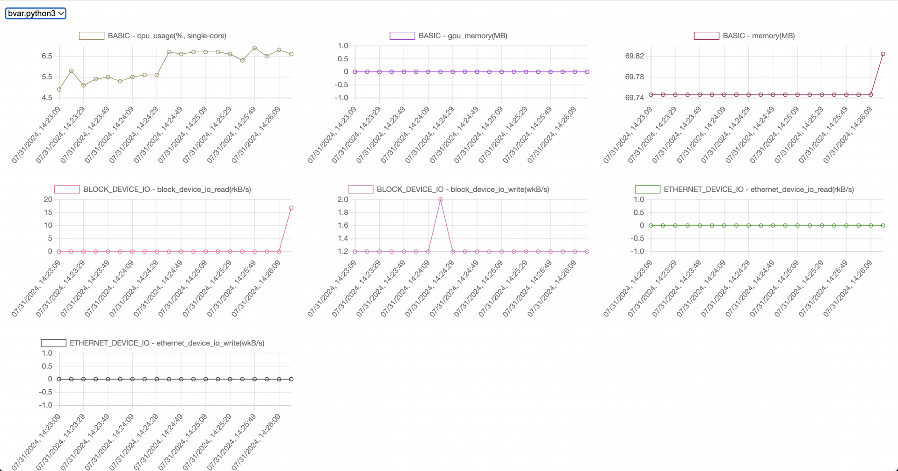

The button in the upper left corner can be used to select the process to be displayed, usually in the following format: mainboard.xxx.dag, where xxx.dag is the name of the module's startup dag, e.g., the control module is called mainboard.control.dag. There are also two exceptions, system represents the system's performance metrics, while bvar.python3 is the performance indicator for the software cyber_performance.

After selecting the process, there will be several charts named xx - yy - zz or xx - yy, where xx stands for the type of metrics, which currently are：

- BASIC：record the basic performance metrics, including cpu utilization, gpu utilization, memory usage, graphics memory usage
- BLOCK_DEVICE_IO：record block device IO metrics
- ETHERNET_DEVICE_IO：record the ethernet IO metrics
- E2E_LATENCY：latency of the component Proc function

> yy refers to the metric name, while zz will only exist in the BLOCK_DEVICE_IO and ETHERNET_DEVICE_IO types, representing the name of the device.
>
> By using the above charts, you can quickly determine how much cpu, gpu, memory, gpu memory and IO are consumed by different processes in the autonomous driving system, which helps to locate the process bottlenecks.
>
> The visualization interface shows real-time values, and cyber will dump the performance data to the data directory. If you need to calculate the mean value, you can parse it using the performance_parse.py script in /apollo/scripts：
>
> python3 /apollo/scripts/performance_parse.py -f data/performance_dumps.07-29-2024.json
>
> where：
>
> - -f specifies the performance monitoring file, which is currently generated in the data directory of the workspace directory.

### Function-level performance analysis

#### cpu and memory

cyber's performance analysis feature can sample cpu and memory usage and generate heatmaps or DAG for analysis.

#### usage

##### new arguments of mainboard：

```bash
I0409 16:54:22.506175 18008 module_argument.cc:113] []command: mainboard -h
I0409 16:54:22.506390 18008 module_argument.cc:33] []Usage:
    mainboard [OPTION]...
Description:
    -h, --help: help information
    -d, --dag_conf=CONFIG_FILE: module dag config file
    -p, --process_group=process_group: the process namespace for running this module, default in manager process
    -s, --sched_name=sched_name: sched policy conf for hole process, sched_name should be conf in cyber.pb.conf
    --plugin=plugin_description_file_path: the description file of plugin
    --disable_plugin_autoload : default enable autoload mode of plugins, use disable_plugin_autoload to ingore autoload
    -c, --cpuprofile: enable gperftools cpu profile
    -o, --profile_filename=filename: the filename to dump the profile to, default value is ${process_group}_cpu.prof. Only work with -c option
    -H, --heapprofile: enable gperftools heap profile
    -O, --heapprofile_filename=filename: the filename to dump the profile to, default value is ${process_group}_mem.prof. Only work with -c option
```

The -c statement enables cpu sampling and the -H statement enables memory sampling, and the module can be started with the following commands：

```bash
mainboard -d /apollo/modules/planning/planning_component/dag/planning.dag -c -H
```

By default, ${process_group}\_cpu.prof and ${process_group}\_mem.prof sampling files will be generated under the current path.

Sampling can also be added to the launch file, for example, the launch file of planning

```xml
<cyber>
    <module>
        <name>planning</name>
        <dag_conf>/apollo/modules/planning/planning_component/dag/planning.dag</dag_conf>
        <cpuprofile>/apollo/planning_cpu.prof</cpuprofile>
        <memprofile>/apollo/planning_mem.prof</memprofile>
        <process_name>planning</process_name>
    </module>
</cyber>
```

Add cpuprofile and memprofile tags, running this launch will generate planning_cpu.prof, planning_mem.prof sample files under /apollo path.

> While cpu sampling generates only one file, memory sampling generates multiple files, each representing the memory situation of the process at the time of generation：

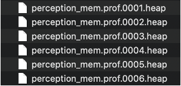

> Due to the performance impact of memory and cpu sampling, it is not recommended to enable both types of sampling at the same time.

##### Generate visualization results

CPU：Use the following command to visualize the sampling results and generate a flame graph:

```bash
buildtool sampling planning_cpu.prof
```

memory：Generate memory-sampled directed acyclic graphs or flame diagrams on demand

Analyzing memory hotspots：Find out what code or functions are causing large memory allocations

```bash
pprof --svg $(which mainboard) planning_mem.prof.0001.heap > a.svg # generated DAG
buildtool sampling planning_mem.prof.0001.heap                     # generated flame graph
```

> DAG come with memory information, making it clearer which function allocates how much memory, while flame graphs are more intuitive, and developers can choose which type of graph to generate according to their habits

Analyzes how much memory was allocated by which function between two moments, often used to troubleshoot memory leaks.

```bash
pprof --svg --base planning_mem.prof.0005.heap $(which mainboard) planning_mem.prof.0001.heap > a.svg
```

##### Analysis

cpu

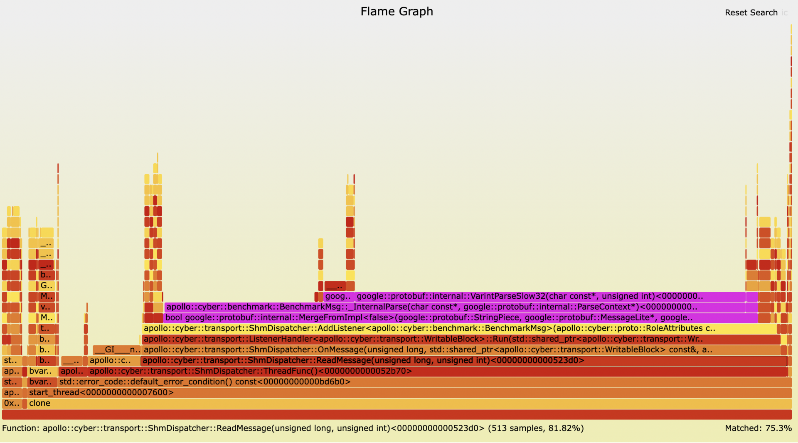

The above is the flame graph of the cyber example communication program, from bottom to top represents the function call stack, and the length represents the percentage of CPU resources occupied by the function in the whole process, for example, ReadMessage in the above graph, which accounts for 81.82%, it can be seen that this part occupies the majority of the cpu time slice, so through the flame graph we can know that we need to optimize the top, the longer function (high percentage) of the graph to optimize, so as to reduce the process of cpu consumption.

memory

Analyzing memory hotspots

Finding memory hotspot allocations through flame graph or DAG


Both flame graph and DAG find memory hotspot allocations; similarly, the flame graph represents the function call stack from bottom to top, and the length represents the percentage of memory allocated by the function throughout the process；

while DAG：

- The top left corner of the directed graph illustrates how much memory the process has allocated in total in the current snapshot point in time
- The boxes represent the actual functions, with two numbers in each box:
  - The first number represents how much memory the current function has allocated
  - The second number represents how much memory the called function has allocated respectively
  - The line represents the chain of stack

The above approach allows you to quickly locate the function where the memory hotspot was allocated and the corresponding call chain.

Memory Leak Analysis：

Memory leaks are usually based on the following command comparing memory allocation diffs at different points in time：

```bash
pprof --svg --base planning_mem.prof.0005.heap $(which mainboard) planning_mem.prof.0001.heap > a.svg
```

The above command generates a DAG of the memory diff at two points in time. If you find that the size of a function's allocation keeps increasing at different points in time, it indicates that there may be a memory leak:

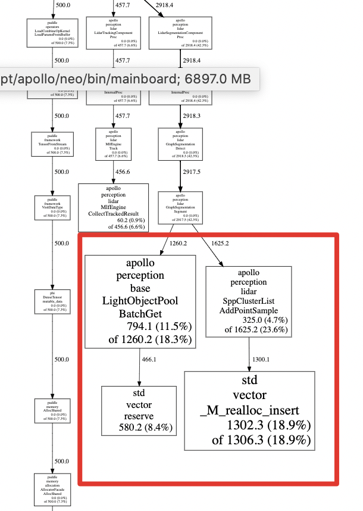

### gpu and gpu memory

GPU analysis needs to be based on NVIDIA Nsight Systems tools, respectively:

- nsys system：For finding performance bottlenecks, understanding application structure, identifying synchronization and concurrency issues, and optimizing overall performance
- nsys compute：Performance analysis focused on individual CUDA core functions to tune CUDA core function parameters, analyze register usage, shared memory usage, execution paths, and memory access patterns to improve core function performance

> Similar to gperftools, nsys can have a serious impact on process performance and should only be used in the R&D and analysis phases, and should not be used in road testing phase.

#### usage

Launch tool samples the process (as an example of perception)：

```bash
sudo -E nsys profile --gpu-metrics-device all --cuda-memory-usage true --delay=15 --duration=30 -f true -o preception --trace=cuda,cudnn,cublas,osrt,nvtx mainboard -d /apollo/modules/perception/msg_adapter/dag/msg_adapter.dag -d /apollo/modules/perception/pointcloud_preprocess/dag/pointcloud_preprocess.dag -d /apollo/modules/perception/pointcloud_map_based_roi/dag/pointcloud_map_based_roi.dag -d /apollo/modules/perception/pointcloud_ground_detection/dag/pointcloud_ground_detection.dag -d /apollo/modules/perception/lidar_detection/dag/lidar_detection.dag -d /apollo/modules/perception/lidar_detection_filter/dag/lidar_detection_filter.dag -d /apollo/modules/perception/lidar_tracking/dag/lidar_tracking.dag
```

- profile: Specifies for sampling
- --gpu-metrics-device all: Specifies for sampling metrics of gpu
- --cuda-memory-usage true: Specifies to keep track of the allocated memory in cuda
- --delay=15 --duration=30: Specifies that sampling starts 15s after the program is started and ends after 30 seconds of sampling
- -f true: Specifies that the generated report document overwrites an existing report
- -o preception: Specifies the name of the report to be generated, and a perception.nsys-rep file will be generated in the current path after the acquisition is completed
- --trace=cuda,cudnn,cublas,osrt,nvtx: Specify the API for sampling
- mainboard ...: Normal command for startup perception

> Note: sampling requires sudo privileges

Open the nsys

```bash
nsys-ui
```

Open the file generated by the sampling

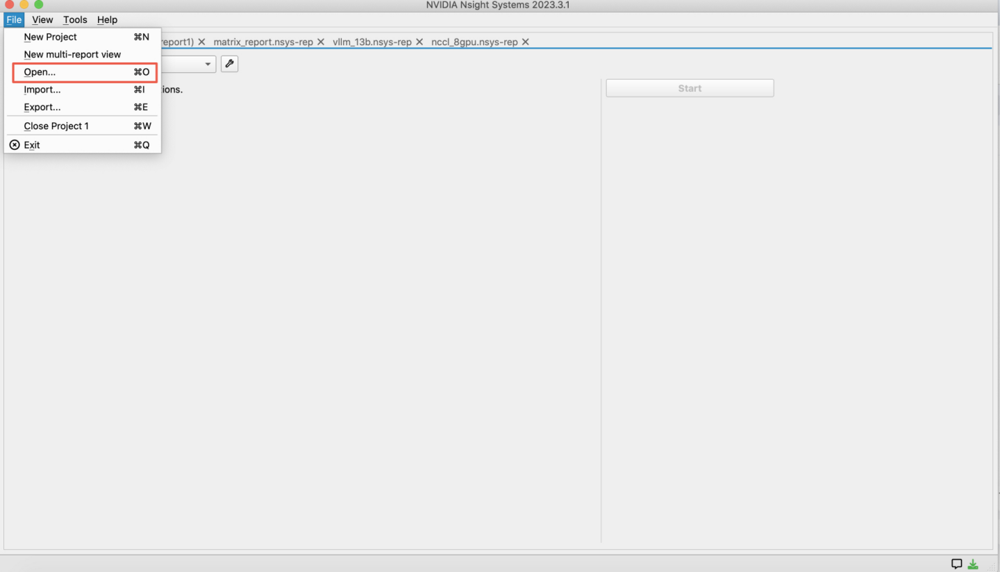

When it opens it will have the following columns：

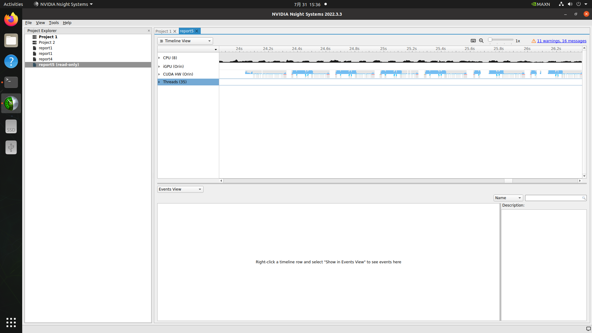

Among them:

- The cpu column includes the cpu usage while the process is running
- The iGPU column contains the performance metrics for each gpu on the orin.
- The CUDA HW contains the kernel functions running in each cuda stream
- Threads contain the various functions running in the process, including cpu system libraries and interfaces such as cuda, cublas, cudnn, etc. These functions place the corresponding core function into the stream's wait queue, waiting to be run by the CUDA HW

> A brief introduction to the logic of executing a cuda kernel function, when a program calls a kernel function in the application, the hardware does not execute it immediately, but fires it into a queue waiting to be executed when the gpu is able to handle it

The horizontal axis is the timeline of the process run

when unfolded：


The timeline can be divided into two parts, the second part (green box) can be seen that the behavior of the gpu is constantly repeated, which can be seen to belong to the model inference; the first part (blue box) is that the model is undergoing initialization, and the performance analysis mainly focuses on the part of the model inference

Amplifying a particular inference：


As I mentioned earlier, the iGPU column contains several gpu metrics, and the one we are more concerned about is the SM occupancy (corresponding to the red box); in addition, the CUDA HW column records the kernel functions that are executed in hardware on the timeline; and the green box corresponds to the cuda API used to launch this kernel function

With the SM Warp Occupancy column, when SM occupancy is high (as shown in the above figure, occupancy reaches 95%), it is possible to quickly locate and obtain detailed information about the corresponding executing core function:


and the call chain at the launch of this kernel function：

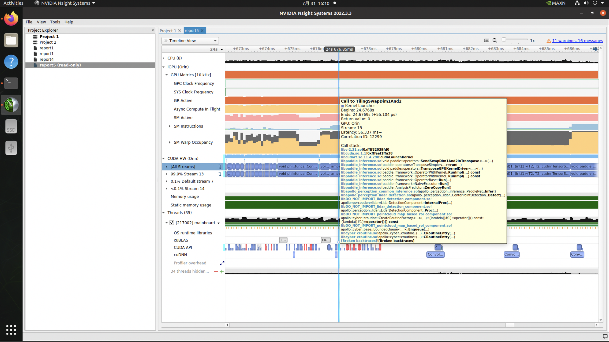

With the above information, for the kernel function we wrote ourselves, we can quickly locate the bottleneck; for model inference, the situation is relatively complicated, because each kernel function in it is equivalent to an operator, and it is hard to precisely match to which layer of the model

For the model inference problem, if using

- tensorRT：

  - The layer corresponding to the kernel function can be determined by naming the layer via the tensorRT API, nvinfer1::INetworkDefinition::setLayerName
  - Or NVTX creates the appropriate point in time：

  ```cpp
  #include <nvToolsExt.h>

  // start a new NVTX
  nvtxRangePush("LayerName");

  // executing

  // end NVTX
  nvtxRangePop();
  ```

  - You can then see the statistics for the corresponding kernel function in the corresponding timeline on the nsight system

- paddle: paddle built-in profiler, you can also view the operation of each layer of each operator, details can refer to the: https://www.paddlepaddle.org.cn/documentation/docs/zh/2.3/guides/performance_improving/profiling_model.html

For gpu memory analysis, the nsight system has a similar output：

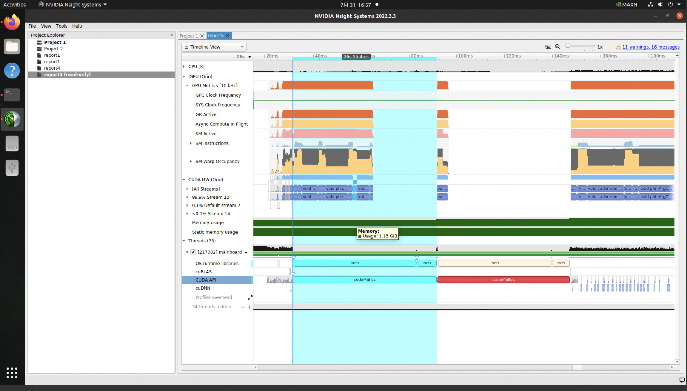

Similarly, with the above information, the bottleneck can be quickly located for allocation functions such as cudaMalloc, which we wrote ourselves; and for model inference, it is necessary to determine which layer of allocated memory belongs to in a similar way to NVTX

## Optimization Recommendations

### cpu

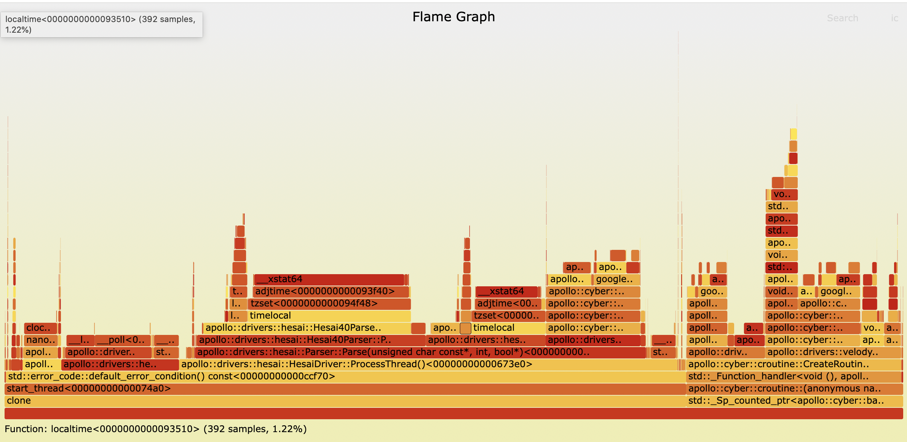

The main idea of optimization is to optimize the top, longer functions (with a high percentage) in the flame graph, and in general the following can be considered：

- Can this type of function be removed：
  - For example, in the above figure, the tzset function takes up about 20% of the cpu time slice, and the kernel solves for the time zone through complex calculations when the TZ environment variable is not set, whereas there are no such calculations when the TZ environment variable is set
- This type of function involves complex calculation：

  - Consider the possibility of using lower time complexity algorithms
  - Consider whether operations can be parallelized：

    - Use cuda to accelerate calculations and release occupied cpu time to reduce cpu usage
    - Parallel processing operations using the SIMD instruction set: SIMD means Single Instruction Multiple Operations, which is a set of instructions that allows mathematical operations on multiple data to be processed at the same time. For example, the following code uses the neon instruction set on the ARM architecture to process eight unsigned integers in parallel, requiring only four instructions：

    ```cpp
    for (int j = 0; j < height_; j += 2) {
        for (int i = 0; i < width_; i += 16) {
            // 读取16个像素点到双通道寄存器中，其中通道1存储y分量，通道2存储uv分量 (32 bytes)
            uint8x16x2_t row0 = vld2q_u8(usrc + j * width_ * 2 + i * 2);
            uint8x16x2_t row1 = vld2q_u8(usrc + (j + 1) * width_ * 2 + i * 2);

            // 提取y分量
            uint8x16_t y0 = row0.val[0];
            uint8x16_t y1 = row1.val[0];

            // 保存y分量到数组中
            vst1q_u8(yPlane + yIndex, y0);
            vst1q_u8(yPlane + yIndex + width_, y1);
            yIndex += 16;

            // 提取uv分量
            uint8x16_t u0 = row0.val[1];
            uint8x16_t v0 = row1.val[1];

            // 求uv分量均值（减轻下采样丢失数据的影响）
            uint16x8_t u16_low = vaddl_u8(vget_low_u8(u0), vget_low_u8(v0));
            uint16x8_t u16_high = vaddl_u8(vget_high_u8(u0), vget_high_u8(v0));
            uint8x8_t u8_avg_low = vshrn_n_u16(u16_low, 1);
            uint8x8_t u8_avg_high = vshrn_n_u16(u16_high, 1);

            uint16x8_t v16_low = vaddl_u8(vget_low_u8(row0.val[1]), vget_low_u8(row1.val[1]));
            uint16x8_t v16_high = vaddl_u8(vget_high_u8(row0.val[1]), vget_high_u8(row1.val[1]));
            uint8x8_t v8_avg_low = vshrn_n_u16(v16_low, 1);
            uint8x8_t v8_avg_high = vshrn_n_u16(v16_high, 1);

            uint8x16_t u_avg = vcombine_u8(u8_avg_low, u8_avg_high);
            uint8x16_t v_avg = vcombine_u8(v8_avg_low, v8_avg_high);

            // 保存uv分量到数组中
            vst1_u8(uPlane + uIndex, u8_avg_low);
            vst1_u8(vPlane + vIndex, v8_avg_low);
            uIndex += 8;
            vIndex += 8;
        }
        yIndex += width_; // Skip to the next line
    }
    ```

  - Consider whether operations can be performed on non-cpu hardware: for example, the nvjpeg chip on the orin can be specialized for tasks such as image compression.

### memory

Along the same lines as cpu, we need to see what functions we can optimize. flame graph and DAG allow us to see the approximate percentage of memory allocated by each function and the exact value, for example, to predict the process：


Generally speaking, you can consider the following points:

- Whether the process links libraries such as cuda and tensorrt: libraries such as cuda and tensorrt request memory in each process, which is similar to a “singleton” in C++, in other words, this part of the memory can be reused. If the perception and prediction processes are started separately, this part of memory will be required twice, while if the perception and prediction processes are combined in the launch file to start a single process, this part of memory will only be required once. If the system has a large number of gpu-using processes, it can be merged into one to further reduce the memory.
- Whether there are cases where memory is requested but not used, this can be analyzed in detail by sampling results.

### gpu

The gpu optimization is divided into latency optimization and utilization optimization, which correspond to different objectives:

- Latency optimization: reduce the processing latency of one or more core functions of the gpu, this type of optimization may increase gpu utilization
- Utilization optimization: reduce the usage of one or more core functions of the gpu

#### algorithm optimization：

Use of more efficient models/algorithms with lower time complexity

#### Universal Optimization：

##### limitation of cpu

Phenomenon: blank space on timeline

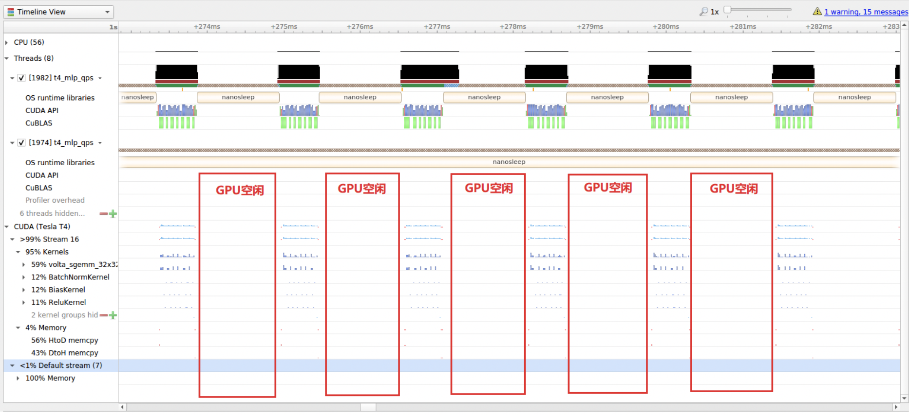

Optimization approach: determine the behavior of the cpu during this blanking time and reduce the blanking time (refer to the cpu optimization approach)

Optimization effect on latency, little effect on utilization

##### Memcpy on timeline：


Optimization approach:

- Reduce redundant transmissions
- use chunky transfers to utilize bandwidth as much as possible
- use unified memory to reduce memcpy if hardware supports unified memory (jetson device)：

unified memory code sample：

```cpp

char* ptr = (char*) malloc(nums * sizeof(char))
char* gpu_ptr = nullptr;

cudaError_t err = cudaHostRegister(ptr, nums * sizeof(char), cudaHostRegisterMapped);

err = cudaHostGetDevicePointer(&gpu_ptr, ptr, 0);

```

Optimized for both latency and utilization

##### The number of small kernels is high and the kernel launch time is higher than the execution time:

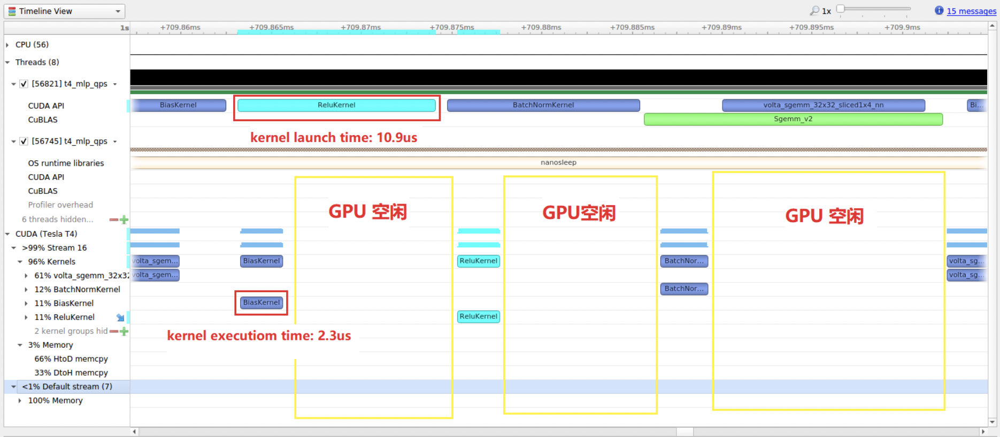

Optimization approach:

kernel fusion：Fusion of small kernel into large kernel to reduce the number of firings

cudaGraph：Combine multiple kernel into a cudaGraph：


cudaGraph sample：

```cpp
#include <cuda_runtime.h>

__global__ void myKernel(int *data, int N) {
    int idx = threadIdx.x + blockIdx.x * blockDim.x;
    if (idx < N) {
        data[idx] += 1;
    }
}

int main() {
    const int N = 1024;
    int *d_data;
    cudaStream_t stream;
    cudaGraph_t graph;
    cudaGraphExec_t graphExec;

    // allocate memory
    cudaMalloc(&d_data, N * sizeof(int));

    // create cuda stream
    cudaStreamCreate(&stream);

    // record cuda graph
    cudaStreamBeginCapture(stream, cudaStreamCaptureModeGlobal);

    dim3 blockSize(256);
    dim3 gridSize((N + blockSize.x - 1) / blockSize.x);
    myKernel<<<gridSize, blockSize, 0, stream>>>(d_data, N);

    // end of recording cuda graph
    cudaStreamEndCapture(stream, &graph);

    // start a graph
    cudaGraphInstantiate(&graphExec, graph, NULL, NULL, 0);
    cudaGraphLaunch(graphExec, stream);

    // sync cuda stream
    cudaStreamSynchronize(stream);

    // clean resources
    cudaGraphExecDestroy(graphExec);
    cudaGraphDestroy(graph);
    cudaStreamDestroy(stream);
    cudaFree(d_data);

    return 0;
}
```

Optimized for latency

##### When SM occupancy is not 100%, kernel functions with no dependencies can be executed in parallel, by means of multiple streams (i.e., changing serial to parallel)

single stream：


multiple stream：


sample：

```cpp
#include <cuda_runtime.h>

__global__ void myKernel(int *data, int N) {
    int idx = blockIdx.x * blockDim.x + threadIdx.x;
    if (idx < N) {
        data[idx] = data[idx] + 1;
    }
}

int main() {
    const int N = 1024 * 1024;
    const int numStreams = 4;
    const int streamSize = N / numStreams;
    const int blockSize = 256;
    const int gridSize = streamSize / blockSize;

    int *d_data;
    cudaStream_t streams[numStreams];

    cudaMalloc(&d_data, N * sizeof(int));

    for (int i = 0; i < numStreams; ++i) {
        cudaStreamCreate(&streams[i]);
    }

    for (int i = 0; i < numStreams; ++i) {
        int offset = i * streamSize;
        myKernel<<<gridSize, blockSize, 0, streams[i]>>>(d_data + offset, streamSize);
    }

    for (int i = 0; i < numStreams; ++i) {
        cudaStreamSynchronize(streams[i]);
    }

    for (int i = 0; i < numStreams; ++i) {
        cudaStreamDestroy(streams[i]);
    }
    cudaFree(d_data);

    return 0;
}
```

Optimized for latency, while the utilization will be significantly increased

##### Reduce kernel latency:


To reduce the latency of a kernel, you need to know the SOL (Speed Of Light) metric of the kernel, which can be sampled using the nsight compute:：

- Memory SOL: This metric indicates how efficiently the application is accessing global memory. It is derived by comparing the actual memory bandwidth utilized by the application to the maximum memory bandwidth of the GPU. If Memory SOL is low, it means that there may be a memory access bottleneck.
- SM SOL: This metric indicates how efficiently the application performs computational tasks. It is derived by comparing the computational performance of the application to the maximum computational performance (peak floating point) of the GPU. If the SM SOL is low, it means that the computational resources may be underutilized.

Two general scenarios may occur:

- Access to memory is limited：low Memory SOL


- Calculation is limited：low SM SOL


Optimization approach：

- Access to memory is limited：Reduce use of global memory, use shared memory within blocks


- Calculation is limited：

  - Use high throughput instructions: reduce precision (fp64->fp32, fp32->fp16/int8); use fast math functions (\_\_func())
  - Reduce branching within a warp: a warp is an execution unit consisting of a certain number of threads, a warp is the basic unit of GPU scheduling and execution of instructions, where all threads execute the same sequence of instructions, assuming that a warp has 32 threads for a kernel function where branching exists

  ```cpp
  if (threadIdx.x < 16) {
      // do something A
  } else {
      // do something B
  }
  ```

  The first half of the warp (threads 0-15) will perform operation A and the second half (threads 16-31) will perform operation B. The GPU will be first for the thread that performs operation A then for the thread that performs operation B. The GPU will be first for the thread that performs operation A then for the thread that performs operation B. In this case, the warp is only half as efficient as it could be. In this case, the efficiency of the warp is only half of its maximum, resulting in a limited computation.

  Therefore, it is important to ensure that all threads within a warp execute the same instructions as much as possible, and reducing the number of intra-wrap branches improves the SOL of the SM.
