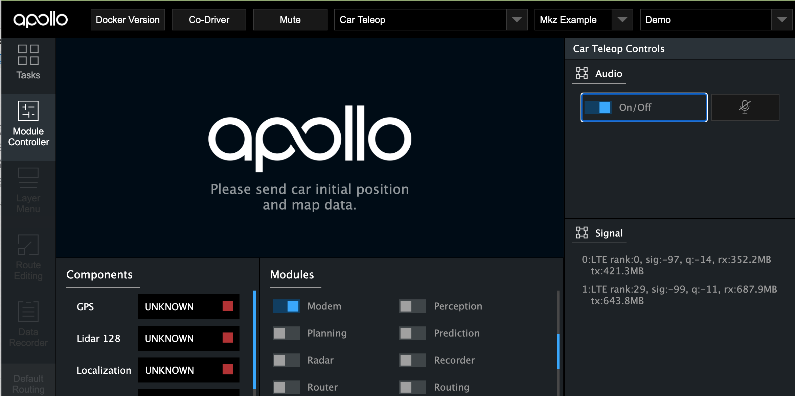
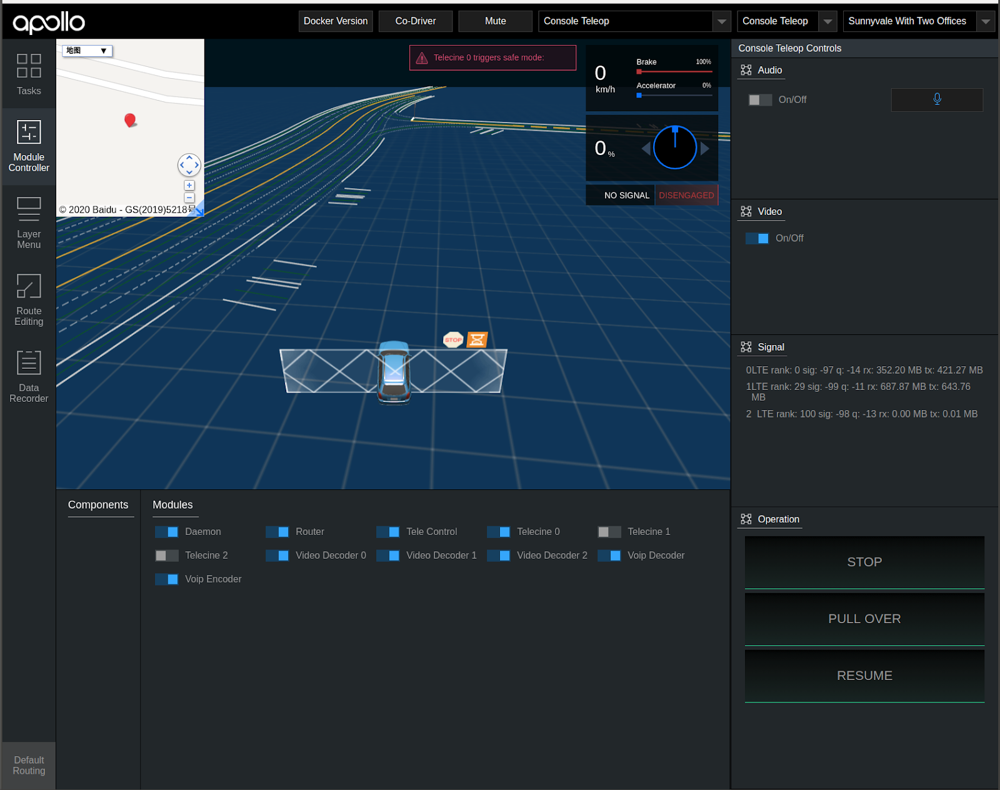

# Dreamview for Teleoperation (Remote Control)

## Introduction
When the autonomous car is running without any driver, it is paramount to add the extra layer of safety by providing teleoperation or remote control ability between the autonomous car and the control center staffed with well-trained teleoperators. Passengers in the autonomous car may need to communicate with the teleoperator about urgent situations. Safety operator also needs to have a full picture of the traffic situation the autonomous car is in before one can make the best decision. Therefore we will need at least some audio and video streaming functionalities. When the teleoperator chooses one of the emergency actions such as "pull-over", the autonomous car also needs to respond with appropriate motion planning. We will also need to monitor network sigal strength as it involves remote data transmission.

Dreamview module tries to provide a web interface that helps to operate and visualize the teleoperation features. It defines some interfaces for data transmission so that users can design and implement their own audio/video streaming and network modules as long as it conforms to the interfaces.

## Teleop Service

### User Interface
There are two types of views supporting the teleoperation service. The first one, called *Car Teleop*, is run on the autonomous car, and contains minimal teleop features for the passengers to stay informed. The other one, called *Console Teleop*, is run in the control center with GUI for the teleoperator to observe the traffic situation and issue commands when needed.

#### Car Teleop

In addition to monitoring the status of modules working on the self-driving feature, we also monitor the status of network router, video encoder, and audio modules.

The passenger will be able to initiate audio communication with the teleoperator by toggling on the audio feature. Once turned on, it enables both microphone and speaker for conversation on both sides. The passenger can mute oneself if desired.

If the user decides to connect with more than one network modems to make sure data is never lost, we also show the signal strength of each modem in a list, as long as the information is provided in accordance with [modem_info.proto](proto/modem_info.proto).

If there is a pull-over or emergency stop request issued by the teleoperator, there will be a visual/audio signal for the passenger to be aware of the situation. Meanwhile an acknowledgement will also be sent back to the teleoperator automatically.

The router, video encoder etc. also resides in the autonomous car system. However the passenger does not need to have access to them. They should be toggled on either by default or triggered when the teleoperator requests for video streaming.

#### Console Teleop

Similar to the basic setup in [teleop car](#car-teleop) view, we also monitor the status of additional modules such as network router, video decoder, image viewer and audio.

The teleoperator will be able to initiate audio communication with the remote passenger by toggling on the audio feature. Once turned on, it enables both microphone and speaker for conversation on both sides. The teleoperator can mute oneself if desired.

In order to get a full view of the traffic situation the remote car is in, the teleoperator needs to toggle on one or more viewing windows for video streaming. The request should automatically turn on the video decoder module in the control center, as well as the video video encoder in the remote car. Network router module should be automatically turned on when starting the teleop process.

Again if the user decides to connect with more than one network modems to make sure data is never lost, we also show the signal strength of each modem in a list. The modem information can be provided by the user according to the format [modem_info.proto](proto/modem_info.proto).

Based on one's assessment of the situation, the teleoperator can issue either a pull-over or emergency stop request if necessary. Two separate visual/audio signals are provided to acknowledge this command has been issued by the teleoperator and then received by the remote car.

To provide a top-down view of the location of the remote car, we also supports expandable map using Baidu Map API.

### User Commands
Dreamview module only provides an interface for teleoperation. It needs to work with a few backend processes to complete the desired audio/video streaming and emergency operations. Here is a list of possible hardwares needed and processes users need to implement in the programming language they chose.
- Network Interface Card
- Modem
- Router
- Video encoder/decoder
- Image viewer
- VOIP encoder/decoder

As you would expect for Apollo, most messages are communicated via cyber channels. So the interaction between Dreamview and user-defined backend processes are also expected to be done via cyber messages. An example can be seen in [daemon_channels](teleop.cc#L109). Similarly, information about the status of modems needs to be sent to Dreamview via cyber messages [example](teleop.cc#L89).

#### Send Audio Stream
- When "Audio" switch is toggled, both the speaker and microphone are turned on/off for the autonomous car as well as the control center.
- The backend process is not implemented or provided by Dreamview. Users can implement their own application for audio streaming with their choice of programming language and library. Then they can make use of the [daemon_cmd.proto](proto/daemon_cmd.proto) and the corresponding function `SendAudioStreamCmd` in [teleop.cc](teleop.cc#L442) to start/stop the audio streaming process.

#### Send Mic Stream
- When the button with "Microphone" icon is clicked, only the local microphone is turned on/off.
- The backend process is not implemented or provided by Dreamview. Users can implement their own application for audio streaming with their choice of programming language and library. Then they can make use of the [daemon_cmd.proto](proto/daemon_cmd.proto) and the corresponding function `SendMicStreamCmd` in [teleop.cc](teleop.cc#L457) to start/stop the local audio streaming process.

#### Send Video Stream
- When "Video" switch is toggled, both the video encoder on the remote car and the decoder on the control station should be turned on/off.
- The backend process is not implemented or provided by Dreamview. Users can implement their own application for video streaming with their choice of programming language and library. Then they can make use of the [daemon_cmd.proto](proto/daemon_cmd.proto) and the corresponding function `SendVideoStreamCmd` in [teleop.cc](teleop.cc#L420) to start/stop the video streaming process.

#### Send Emergency Stop Command
- When "Stop" button is clicked, a pad message with `DrivingAction` of `STOP`, defined by Protobuf message `PadMessage` in [pad_msg.proto](https://github.com/ApolloAuto/apollo/blob/master/modules/planning/planning_base/proto/pad_msg.proto), will be published by **Dreamview**.
- Upon receiving a pad message with `DrivingAction` of `STOP`, **Planning** module will execute **emergency stop** by abruptly braking and stopping at the current position.

#### Send Emergency Pull-over Command
- When "Pull Over" button is clicked, a pad message with `DrivingAction` of `PULL_OVER`, defined by Protobuf message `PadMessage` in [pad_msg.proto](https://github.com/ApolloAuto/apollo/blob/master/modules/planning/planning_base/proto/pad_msg.proto), will be published by **Dreamview**.
- Upon receiving a pad message with `DrivingAction` of `PULL_OVER`, **Planning** module will execute **emergency pull-over** by safely pulling over as soon as possible.

#### Send Resume Cruise Command
- When "Resume Cruise" button is clicked, a pad message with `DrivingAction` of `RESUME_CRUISE`, defined by Protobuf message `PadMessage` in [pad_msg.proto](https://github.com/ApolloAuto/apollo/blob/master/modules/planning/planning_base/proto/pad_msg.proto), will be published by **Dreamview**.
- Upon receiving a pad message with `DrivingAction` of `RESUME_CRUISE`, **Planning** module will **resume cruising** based on the current routing.

